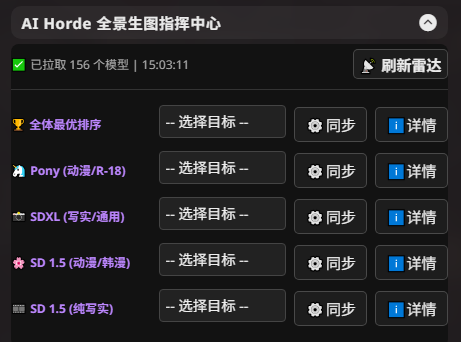
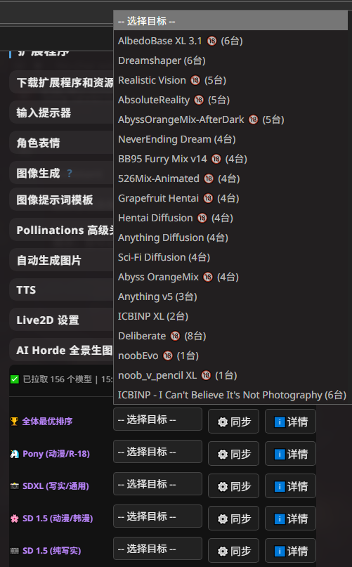
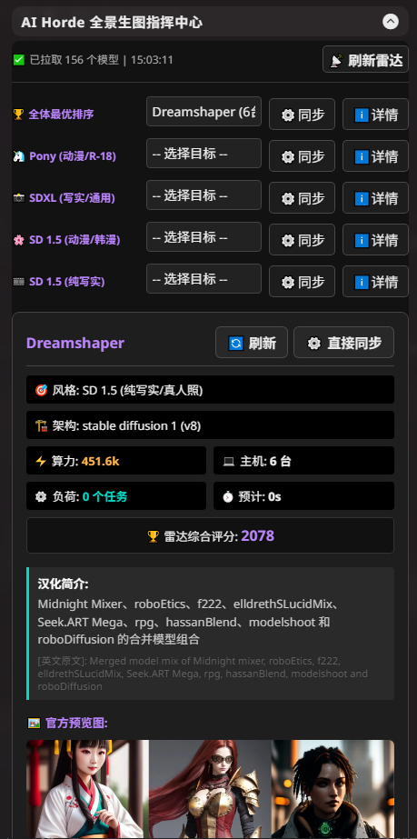
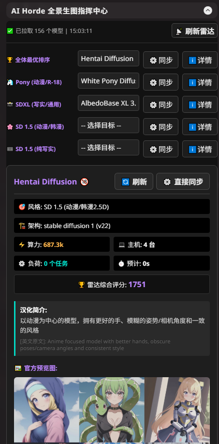
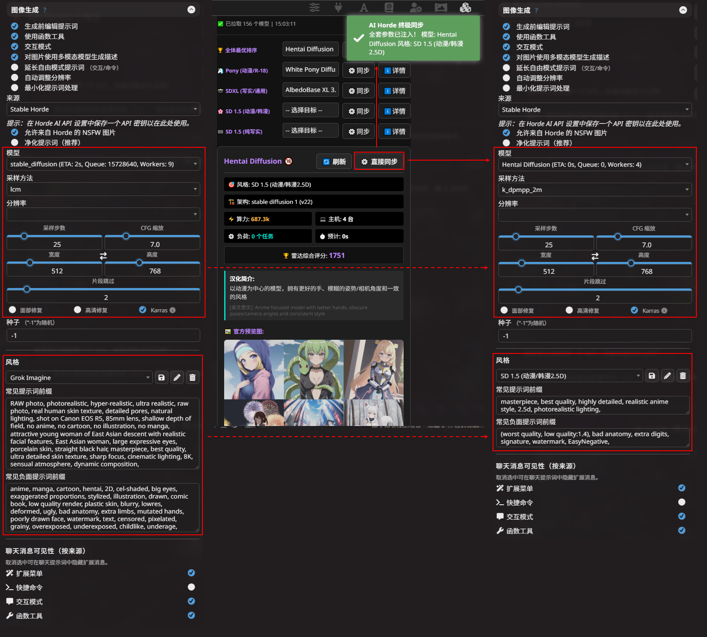

# Horde Radar App 📡 (AI Horde Sync Center)

[简体中文](README_zh.md) | **English**

 

> **Acknowledgments**: Thanks to the [AI Horde](https://aihorde.net/) for their incredible distributed image generation network, and [Haidra-Org](https://github.com/Haidra-Org) for maintaining the model reference database.

An advanced extension designed for [SillyTavern](https://github.com/SillyTavern/SillyTavern). Tired of scrolling through hundreds of models in AI Horde? Unsure about the correct resolution for a specific model? Sick of manually copying and pasting lengthy parameters? **Horde Radar App** takes care of all that grunt work for you!

---

## ✨ Core Radar Features

* **🏆 Exclusive Multi-Dimensional Scoring**: Goes beyond simple queue lengths! Built-in logic calculates a comprehensive score based on processing power, idle worker bonuses, real queue pressure, and ETA penalties to find the fastest available nodes.
* **🧠 Smart Categorization & Parameter Deduction**: Automatically tags and categorizes models into `Pony`, `SDXL`, `SD 1.5 Anime`, and `SD 1.5 Realistic`. It auto-deduces the best resolution (e.g., 832x1216), sampler, and steps for each.
* **⚙️ One-Click Deep Sync**: The core magic. With one click, it injects all the deduced heavy-duty parameters directly into ST's native image generation panel and automatically links your matching "Image Prompt Styles".
* **🌐 Background Auto-Translation**: Silently translates English model descriptions into Chinese with rate-limiting protection and local caching (Designed primarily for CN users).
* **📊 Immersive Intelligence Panel**: Provides comprehensive monitoring of computing power, online workers, real load status, and embeds official gallery showcases. Supports real-time status refreshing for individual models.

---

## 📥 Installation

1. Launch and open **[SillyTavern](https://github.com/SillyTavern/SillyTavern)**.
2. Click the **Extensions** menu at the top (the building block icon).
3. Expand and select **"Install extension"**.
4. Paste the URL of this repository:

       https://github.com/sunjichaocom/sillytavern-horde-radar

5. Click **Install**.

> [!Warning]
> Ensure you have your AI Horde API key configured in ST's Image Generation settings beforehand

---

## 🚀 Usage Guide & Workflow

Open the ST Extensions menu and locate the **Horde Radar App** panel. Follow these intuitive steps:

### 1. Refresh Radar & Categorized Search
Click **Refresh Radar** to fetch the latest online data. The dropdown menus are pre-configured with globally optimized rankings and curated model lists for specific styles.
 
 &nbsp; 

### 2. View Intel & Gallery Previews
After selecting an interesting model, click **Details (详情)**. This expands an immersive intelligence panel showing real-time computing power, descriptions, and official generated preview images.
 
 &nbsp; 

### 3. One-Click Deep Sync
Once you've made your choice, click **Direct Sync (直接同步)**.
The radar will instantly and accurately inject the model's name, optimal resolution, steps, sampler, and other parameters **into the native Image Generation panel on the left**, automatically switching to the corresponding prompt style!
 

---

## 🎨 Recommended Style Presets

To maximize the power of the "One-Click Sync" (which automatically links and fills in your positive/negative prompts), it is **highly recommended** to create the following four styles with exact matching names in ST's `Image Generation -> Styles` panel:

> [!Warning]
> Style names without emojis

> [!NOTE]
> You can use your own preferred prompts. The following are solid baselines:

🦄 <b>Pony (动漫/R-18)</b>

 

* 🦄 **Style Name**: 
  `Pony (动漫/R-18)`
* 🟢 **Positive Prefix**: 
  `score_9, score_8_up, score_7_up, source_anime, masterpiece, best quality, ultra detailed`
* 🔴 **Negative Prefix**: 
  `score_4, score_5, score_6, source_pony, source_furry, source_cartoon, monochrome, 3d, realistic, bad anatomy, bad hands, missing fingers`

📸 <b>SDXL (写实/通用)</b>

 

* 📸 **Style Name**: 
  `SDXL (写实/通用)`
* 🟢 **Positive Prefix**: 
  `masterpiece, best quality, ultra high res, photorealistic, 8k resolution, highly detailed`
* 🔴 **Negative Prefix**: 
  `(worst quality, low quality:1.4), bad anatomy, watermark, text, signature, ugly, deformed`

🌸 <b>SD 1.5 (动漫/韩漫2.5D)</b>

 

* 🌸 **Style Name**: 
  `SD 1.5 (动漫/韩漫2.5D)`
* 🟢 **Positive Prefix**: 
  `masterpiece, best quality, highly detailed, realistic anime style, 2.5d, photorealistic lighting`
* 🔴 **Negative Prefix**: 
  `(worst quality, low quality:1.4), bad anatomy, extra digits, signature, watermark, EasyNegative`

🎞️ <b>SD 1.5 (纯写实/真人照)</b>

 

* 🎞️ **Style Name**: 
  `SD 1.5 (纯写实/真人照)`
* 🟢 **Positive Prefix**: 
  `RAW photo, masterpiece, best quality, ultra-detailed, realistic, photorealistic, 8k uhd, dslr, soft lighting, film grain`
* 🔴 **Negative Prefix**: 
  `(deformed iris, deformed pupils, semi-realistic, cgi, 3d, render, sketch, cartoon, drawing, anime:1.4), (worst quality, low quality:1.4), (deformed, distorted, disfigured:1.3), poorly drawn, bad anatomy, wrong anatomy, extra limb, missing limb, floating limbs, mutated hands, ugly`

---

## 📜 Credits & License

* UI & Core Architecture: **Sun**
* Open-sourced under the **[MIT](LICENSE)** License.